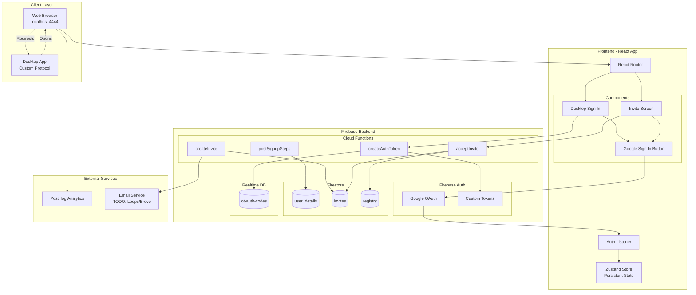
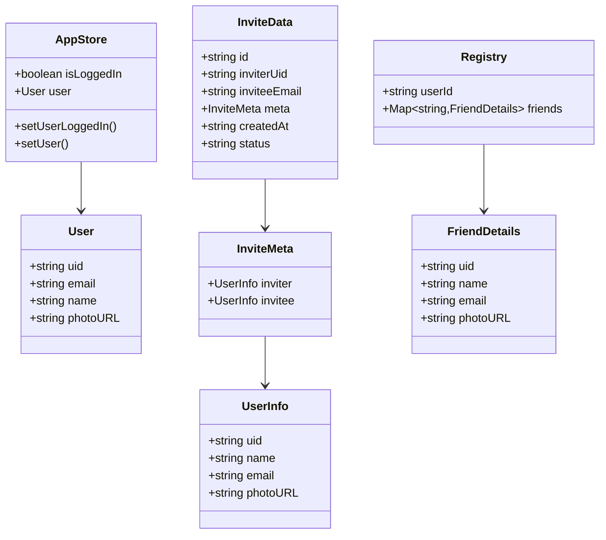
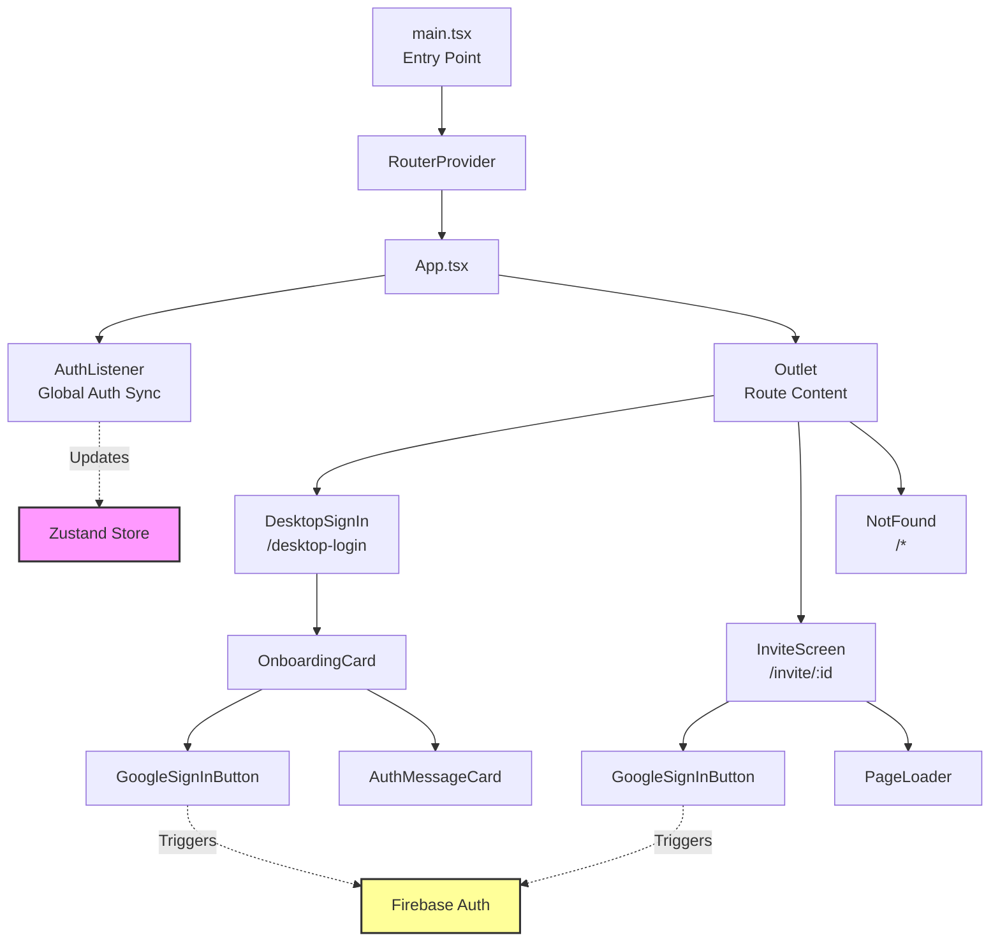
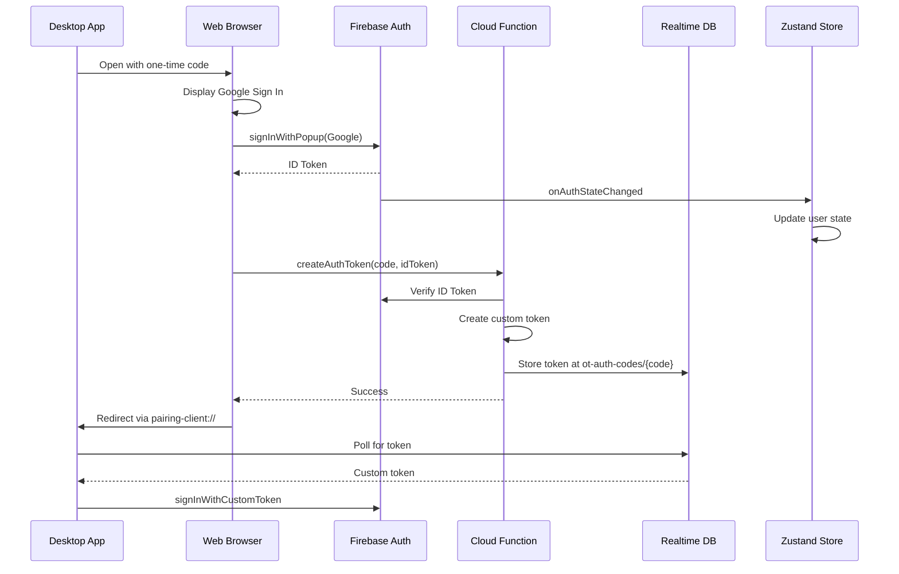
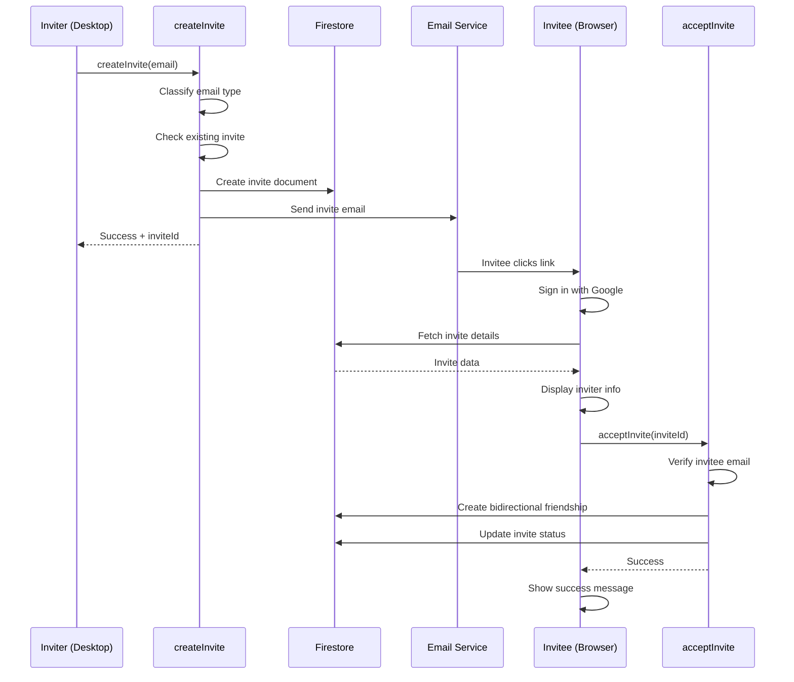
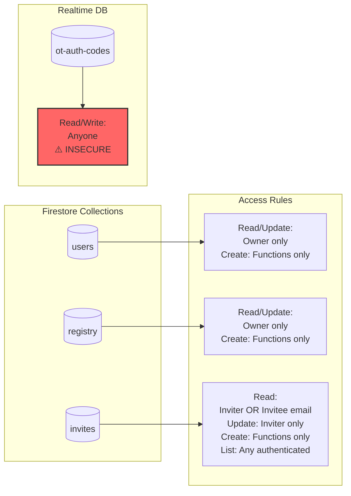

# Velock-Web Architecture Documentation

## System Overview

Velock-web is a web application for desktop app authentication and friend invitation management, built with React and Firebase.

## UML Diagrams

### System Architecture Diagram

### Data Model Diagram

### Component Hierarchy Diagram

### Authentication Flow Diagram

### Invite Flow Diagram

### Security Rules Diagram

## Architecture Layers

### 1. Client Layer
- **Web Browser**: React SPA running on Vite dev server (port 4444)
- **Desktop App**: Native app using custom URL protocol (`pairing-client://`)

### 2. Frontend Layer
- **Framework**: React 19 + Vite
- **Routing**: React Router 7
- **State Management**: Zustand with localStorage persistence
- **Styling**: TailwindCSS 4
- **Analytics**: PostHog

### 3. Backend Layer
- **Firebase Auth**: Google OAuth + Custom tokens
- **Cloud Functions**: 4 callable functions + 1 auth trigger
- **Firestore**: 3 collections (user_details, invites, registry)
- **Realtime Database**: One-time auth codes

### 4. External Services
- **PostHog**: User analytics and event tracking
- **Email Service**: TODO - Loops or Brevo integration

## Key Design Patterns

### 1. Global State Management
- **Pattern**: Zustand store with localStorage persistence
- **Purpose**: Maintain auth state across page reloads
- **Implementation**: `app/src/modules/store.ts`

### 2. Auth State Synchronization
- **Pattern**: Observer pattern via Firebase onAuthStateChanged
- **Purpose**: Sync Firebase auth with local Zustand state
- **Implementation**: `AuthListener` component

### 3. Security by Default
- **Pattern**: Deny-all Firestore rules with explicit allows
- **Purpose**: Prevent unauthorized data access
- **Implementation**: `cloud/firestore.rules`

### 4. Email Classification
- **Pattern**: Strategy pattern for different email types
- **Purpose**: Handle invites differently based on email domain
- **Implementation**: `cloud/functions/src/utils/email.ts`

### 5. Atomic Friendship
- **Pattern**: Firestore transaction for bidirectional updates
- **Purpose**: Ensure both users become friends simultaneously
- **Implementation**: `makeFriends()` in `cloud/functions/src/utils/friend.ts`

## Data Flow

### Authentication Flow
1. User clicks Google Sign In
2. Firebase Auth popup opens
3. User authorizes
4. Firebase returns ID token
5. `onAuthStateChanged` triggers
6. `AuthListener` updates Zustand store
7. Components re-render with auth state

### Desktop Auth Flow
1. Desktop app opens browser with one-time code
2. User authenticates via Google
3. Web calls `createAuthToken(code, idToken)`
4. Function creates custom token
5. Token stored in Realtime DB
6. Web redirects to desktop app
7. Desktop app polls Realtime DB
8. Desktop app uses custom token to authenticate

### Invite Flow
1. User A creates invite via desktop app
2. `createInvite(email)` called
3. Function classifies email type
4. Invite document created in Firestore
5. Email sent to invitee
6. User B clicks invite link
7. User B authenticates
8. Invite details fetched (security rules check email)
9. User B clicks accept
10. `acceptInvite(inviteId)` called
11. Function verifies email match
12. Bidirectional friendship created
13. Invite status updated to 'accepted'

## Security Considerations

### ✅ Secure
- Firestore rules enforce owner-only access
- Invite reads require email match or inviter UID
- All writes go through authenticated Cloud Functions
- Firebase Auth handles authentication

### ⚠️ Needs Attention
- **Realtime Database**: Open read/write (CRITICAL - fix before production)
- **Email validation**: Should validate email format in Cloud Functions
- **Rate limiting**: No rate limiting on invite creation
- **Input sanitization**: Limited input validation

## Performance Optimizations

1. **Zustand shallow comparison**: Prevents unnecessary re-renders
2. **Firebase emulators**: Fast local development
3. **Vite HMR**: Hot module replacement for fast dev feedback
4. **PostHog batching**: Attributes synced every 20s

## Deployment Architecture

### Development
- Frontend: `npm run dev:app` (Vite on port 4444)
- Backend: `npm run dev:cloud` (Firebase emulators)
- Combined: `npm run dev` (Concurrently)

### Production
- Frontend: Deployed to hosting (TBD)
- Backend: Firebase Cloud Functions (auto-scaling)
- Database: Firestore + Realtime DB (managed by Firebase)

## Scalability Considerations

1. **Cloud Functions**: Max 10 instances (configurable)
2. **Firestore**: Scales automatically
3. **Realtime DB**: Single instance, may need sharding at scale
4. **Frontend**: Static hosting, scales with CDN

## Future Enhancements

### High Priority
1. Secure Realtime Database rules
2. Implement email service integration
3. Add invite link generation with proper URLs
4. Auto-accept pending invites on signup

### Medium Priority
5. Implement pairing discovery service
6. Add rate limiting to Cloud Functions
7. Improve error handling and user feedback
8. Add comprehensive logging

### Low Priority
9. Expand analytics tracking
10. Add unit and integration tests
11. Implement invite expiration
12. Add friend removal functionality
